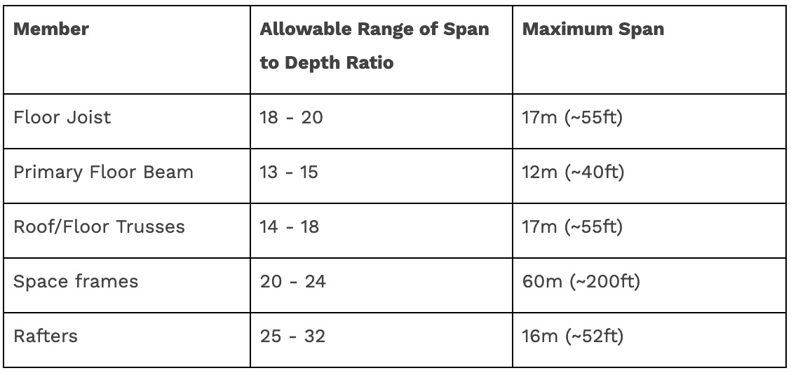

[text](https://www.calctree.com/resources/steel-rules)
[text](https://ncc.abcb.gov.au/editions/2019/ncc-2019-volume-two/part-34-framing/part-344-structural-steel-members)
[text](https://ncc.abcb.gov.au/editions/ncc-2022/adopted/housing-provisions/6-framing/part-63-structural-steel-members)
[text](https://ncc.abcb.gov.au/editions/2019-a1/ncc-2019-volume-two-amendment-1/part-39-safe-movement-and-access/part-392-barriers)
